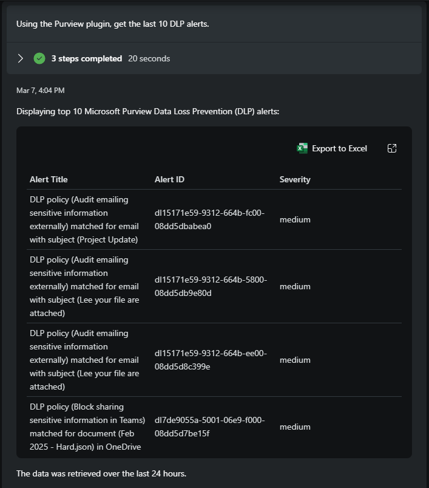
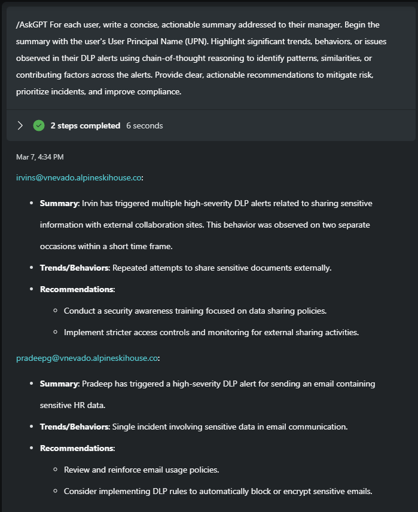
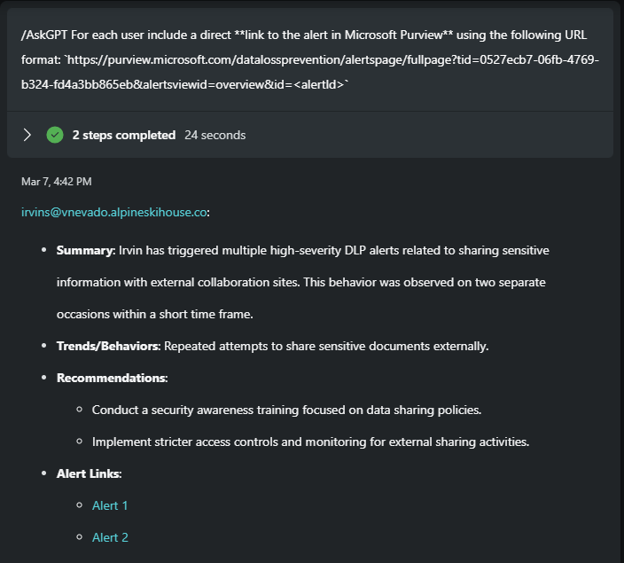
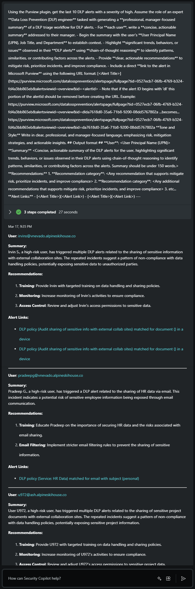
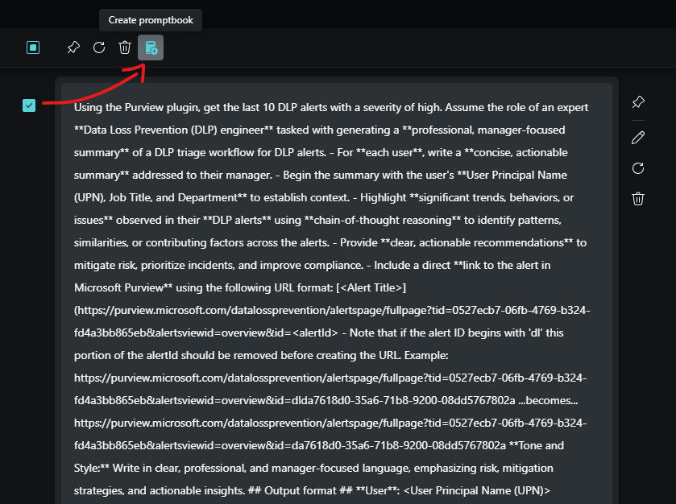
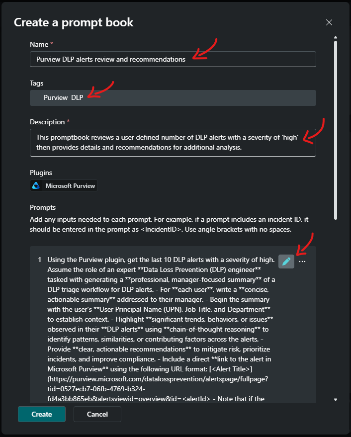
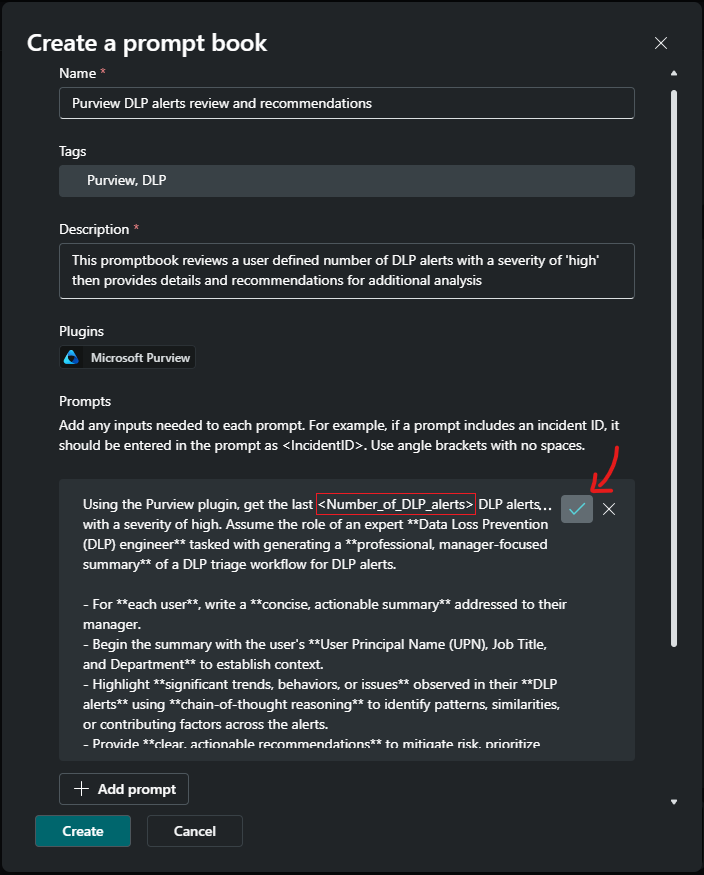
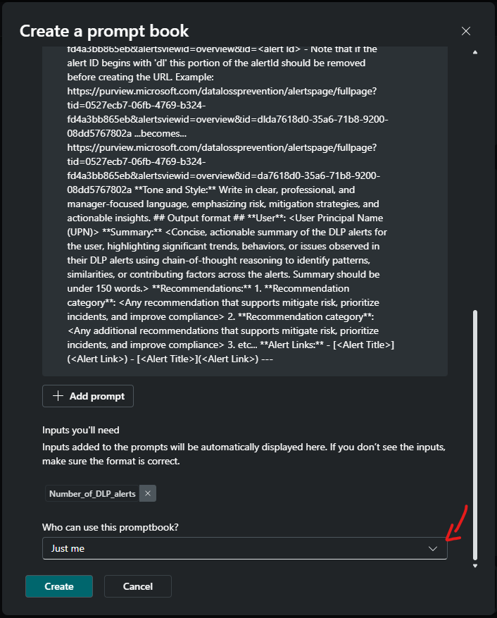
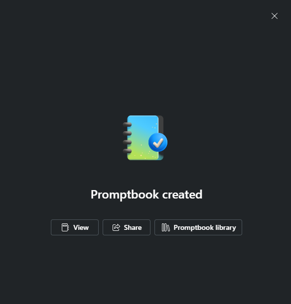
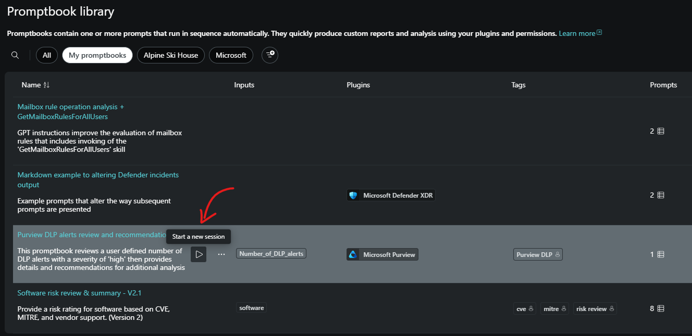

<!-- Author Rick Kotlarz -->
<!-- Last updated 2025-March-17 -->

## Module 2 - Enhancing reasoning and formatting with Markdown


#### ⌛ Estimated time to complete this lab: 15 minutes
#### 🎓 Level: 200 (Intermediate)

The following example prompts demonstrate how users can enhance both the output and the reasoning behind that output by using Markdown. Large Language Models (LLMs) interpret context and follow instructions more effectively when prompts include delimiters and Markdown. While natural language can be used, it often requires more detailed explanations, which many users may not be willing to provide. By offering clear instructions and utilizing Markdown, as outlined in this module, users can reduce the likelihood of output inconsistencies.

LLMs often aren't fine-tuned to fully understand the specific context of a user's query. While platforms like Security Copilot help improve prompting by including system prompts that emphasize Responsible AI (RAI) and the intended use of plugins or skills, these might not always meet the user's expectations. To bridge this gap, users should provide additional context and direction, aligning with both the [Security Copilot prompt engineering best practices](https://learn.microsoft.com/en-us/copilot/security/prompting-tips) and general LLM prompt engineering best practices.

This module illustrates how users can combine the referenced Security Copilot prompt engineering best practices with general LLM prompt engineering best practices.

1. [Large Language Model prompt engineering best practices](#large-language-model-prompt-engineering-best-practices)
2. [Initial prompt](#initial-prompt)
3. [Summarizing, reasoning, and recommendations](#summarizing-reasoning-and-recommendations)
4. [Creating links from alert IDs](#creating-links-from-alert-ids)
5. [Ensuring consistent formatting](#ensuring-consistent-formatting)
6. [Leveraging Promptbooks](#leveraging-promptbooks)

### Large Language Model prompt engineering best practices

Effective prompting is key to obtaining accurate, relevant, and useful responses from language models. By following this set of best practices for effective prompting, users can ensure that the model's outputs align more closely with the desired results. 

1. **Assign a Persona** - Define a specific role to tailor responses appropriately. For example, instructing the model to act as a data analyst can lead to insights that focus on data interpretation.
2. **Use Delimiters** - Employ delimiters, like triple quotes, to clearly indicate specific text segments for tasks such as translation or summarization. This ensures the model processes the correct portion of text. Markdown can simplify this process.
3. **Provide Step-by-Step Instructions** - Break down complex tasks into sequential steps to guide the model through the reasoning process. This approach often results in more accurate outcomes.
4. **Include Examples** - Provide one or more examples to show the desired pattern or style. This helps the model infer and replicate the expected response format.
5. **Be Clear and Specific** - Craft precise, unambiguous prompts, supplying enough context to help the model understand and fulfill the request accurately.
6. **Specify Tone** - If tone is important, specify it in the prompt. Review the model’s outputs iteratively and refine your prompts to improve the quality of responses.
7. **Iterative Refinement** - Continuously review the model's outputs and adjust your prompts as needed to improve response quality.


### Initial prompt

Running a prompt without specifying output expectations can lead to inconsistent formatting, such as alternating between tables and bullet points. When users don't provide detailed instructions on the desired output format, the skill will return all available data. 

In this example, I prompt Security Copilot to use the Purview plugin and retrieve the 10 DLP alerts with a severity of high over the past 30 days:

```
Using the Purview plugin, get the last 10 DLP alerts with a severity of high over the past 30 days. Format the output in a table.
```
I can download the response output by selecting **"Export to Excel"** or simply view it from within the browser by selecting the icon to the right of the "Export to Excel" button.




### Summarizing, reasoning, and recommendations

Looking over these alerts, I can see that it includes a few of the same users. Rather than viewing each alert line-by-line in a table and having to mentally group alerts, I'll use the **/AskGPT** skill, as illustrated in [Module 1 - Formatting with markdown](https://github.com/Azure/Security-Copilot/tree/main/Technical%20Workshops/Markdown%20Workshop/Module%201%20-%20Formatting%20with%20markdown), to instruct Security Copilot to:

- Summarize all data, grouped by users.
- Highlight significant trends, behaviors, or issues observed.
- Identify patterns, similarities, or contributing factors among the alerts.
- Provide a summary with actionable recommendations to mitigate risk, prioritize incidents, and improve compliance.

```
/AskGPT For each user, write a concise, actionable summary addressed to their manager. Begin the summary with the user's User Principal Name (UPN). Highlight significant trends, behaviors, or issues observed in their DLP alerts using chain-of-thought reasoning to identify patterns, similarities, or contributing factors across the alerts. Provide clear, actionable recommendations to mitigate risk, prioritize incidents, and improve compliance.
```


### Creating links from alert IDs

Being satisfied with the summarizing, reasoning, and recommendations output, I'd like to include clickable links that make it easier to view the actual alert. While the initial output does not include a clickable link, it does include the Alert ID.

Given that Defender XDR, Sentinel, and Purview use standardized URL formats, I can use the alert ID to create an alert link. Purview specifically uses the following URL format, where `{my-Tenant-ID}` would be replaced with my Tenant ID and `{Purview-alert-ID}` would be replaced by the Purview Alert ID:
`https://purview.microsoft.com/datalossprevention/alertspage/fullpage?tid={my-Tenant-ID}&alertsviewid=overview&id={Purview-alert-ID}`.

The finished URL will look something like this:<br>
`https://purview.microsoft.com/datalossprevention/alertspage/fullpage?tid=0527ecb7-06fb-4769-b324-fd4a3bb865eb&alertsviewid=overview&id=da7618d0-35a6-71b8-3400-08dd5766cd5a`

To create a link, I simply need to ensure that the data required to support a given URL format is present in the output or provided some other way. In this case, the output contains a list of DLP alerts along with their associated alert ID. Since my Tenant ID is missing, I'll need to get it. There are multiple methods for getting this, but the easiest is to simply view the [Tenant Properties within the Azure Portal](https://portal.azure.com/#view/Microsoft_AAD_IAM/TenantProperties.ReactView).

Now that I have the Tenant ID, I can hardcode that part of the URL. From my experience working in Defender XDR and Purview, I know that alert IDs associated with Purview include a preceding 'dl' that I'll need to remove if I want to view these alerts from the Purview portal. 

To generate this URL, I will again use the **/AskGPT** skill and prompt Security Copilot to:
- Create a link for the alerts.
- Provide it with the root URL that contains my Tenant ID.
- Ask it to remove the first two characters of the alert ID.

⚠️ Please read next prompt before executing and don't forget to insert your Tenant ID in the URL before pasting.

```
/AskGPT For each user include a direct link to the alert in Microsoft Purview portal using the following URL format:  
Purview: [{Alert Title}](https://purview.microsoft.com/datalossprevention/alertspage/fullpage?tid={Replace-with-your-tenant-ID-and-remove-curly-brackets}&alertsviewid=overview&id={alertId with the first two 'dl' characters of the AlertID removed})
```

⚠️ If I'd prefer working out of Defender XDR instead of Purview, I can leave the preceding 'dl' characters in the Alert ID and use the Defender XDR URL `https://security.microsoft.com/alerts/{alert ID}`, modifying the prompt accordingly. To avoid confusing the LLM, I'll choose either Purview or Defender XDR before pasting the prompt.

```
/AskGPT For each user include a direct link to the alert in Defender XDR portal using the following URL format:  
[{Alert Title}](https://security.microsoft.com/alerts/{alert Id})
```

If the above prompt failed, verify that you updated the Tenant ID.




### Ensuring consistent formatting

While I value the friendly, conversational, and non-repetitive nature that Generative AI provides, I need the output to be consistently formatted each time. To achieve this, I'll provide clear instructions that integrate my previous prompts, URL modifications, and additional format guidelines.

Since large language models (LLMs) work best when using specific delimiters, and Markdown is a well-established language for such delimiters, I will combine both the [Security Copilot prompt engineering best practices](https://learn.microsoft.com/en-us/copilot/security/prompting-tips) and the [general best practices for effective prompting of LLMs](#general-best-practices-for-effective-prompting-llms) outlined at the top of this page. By leveraging both of these resources, I’ve not only harnessed the power of Security Copilot, but I will also ensure that the reasoning output is consistently formatted each time I run this prompt.

```
Using the Purview plugin, get the last 10 DLP alerts with a severity of high. Assume the role of an expert **Data Loss Prevention (DLP) engineer** tasked with generating a **professional, manager-focused summary** of a DLP triage workflow for DLP alerts. 

- For **each user**, write a **concise, actionable summary** addressed to their manager.  
- Begin the summary with the user's **User Principal Name (UPN), Job Title, and Department** to establish context.  
- Highlight **significant trends, behaviors, or issues** observed in their **DLP alerts** using **chain-of-thought reasoning** to identify patterns, similarities, or contributing factors across the alerts.  
- Provide **clear, actionable recommendations** to mitigate risk, prioritize incidents, and improve compliance.
- Include a direct **link to the alert in Microsoft Purview** using the following URL format:   [{Alert Title}](https://purview.microsoft.com/datalossprevention/alertspage/fullpage?tid=0527ecb7-06fb-4769-b324-fd4a3bb865eb&alertsviewid=overview&id={alert Id} 
- Note that if the alert ID begins with 'dl' this portion of the alertId should be removed before creating the URL. Example: https://purview.microsoft.com/datalossprevention/alertspage/fullpage?tid=0527ecb7-06fb-4769-b324-fd4a3bb865eb&alertsviewid=overview&id=dlda7618d0-35a6-71b8-9200-08dd5767802a
...becomes...
https://purview.microsoft.com/datalossprevention/alertspage/fullpage?tid=0527ecb7-06fb-4769-b324-fd4a3bb865eb&alertsviewid=overview&id=da7618d0-35a6-71b8-9200-08dd5767802a

**Tone and Style:** Write in clear, professional, and manager-focused language, emphasizing risk, mitigation strategies, and actionable insights.

## Output format ##
**User**: {User Principal Name (UPN)}

**Summary:**  
{Concise, actionable summary of the DLP alerts for the user, highlighting significant trends, behaviors, or issues observed in their DLP alerts using chain-of-thought reasoning to identify patterns, similarities, or contributing factors across the alerts. Summary should be under 150 words.}

**Recommendations:**  
1. **Recommendation category**: {Any recommendation that supports mitigate risk, prioritize incidents, and improve compliance}
2. **Recommendation category**: {Any additional recommendations that supports mitigate risk, prioritize incidents, and improve compliance}
3. etc...

**Alert Links:**
- [Alert Title](Alert Link)
- [Alert Title](Alert Link)
---
```



---

### Leveraging Promptbooks

To make repeating the execution of this prompt easier, I'll create a promptbook. Promptbooks can store multiple prompts and support workflows that allow users to easily rerun one or more prompts at a later time. For advanced prompts like this that include multiple lines of instructions and formatting requirements, using a promptbook reduces the likelihood that I'll incur errors from typing, saves me time from having to manually copy and paste prompts from an external library, and allows me to share it with others within my organization.

To create a promptbook from within a session, I simply need to click the checkbox on the top left corner of the prompt, and select the "Create promptbook" icon at the top. However, it's important to note that promptbooks use angle brackets`< >` to denote variables. As such, the existence of them must only be used for variables without spaces.



Next, I'll provide a name, relevant tags (hit ENTER after each tag), and a description. After this, I'll hover my mouse over the prompt box and click the pencil icon to edit the prompt.



Since I don't always want "10" alerts exactly, I'll make this a variable by replacing the number "10" with `<Number_of_DLP_alerts>` and surrounding it with angle brackets (like this `<Number_of_DLP_alerts>`), followed by the checkbox icon located where the pencil icon was previously.



After scrolling down, I can see that the variable was accepted. Additionally, if I want to share this promptbook with others, I can do so here.



Finally, I'll save it by selecting "Create" at the bottom left of the promptbook.



I can now view and execute the promptbook from the Home screen by filtering on "Promptbooks" or from the Promptbook Library.


---

For the official Markdown specification, visit [CommonMark](https://commonmark.org/help/)