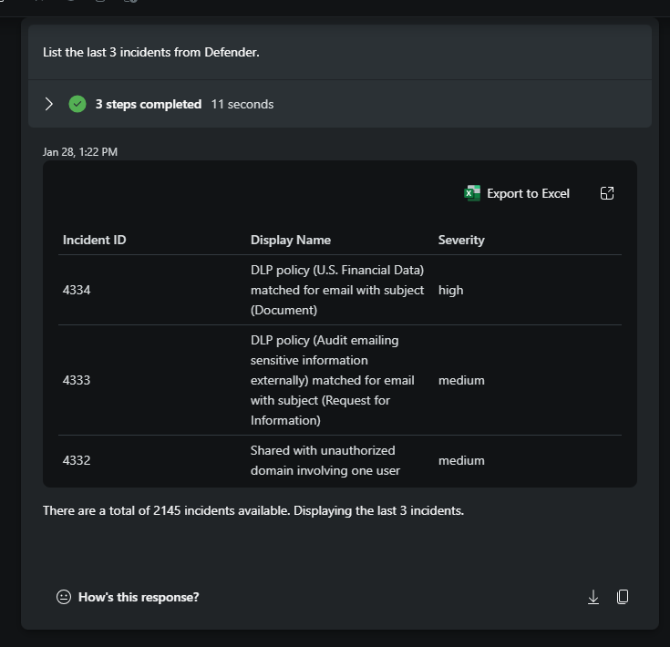
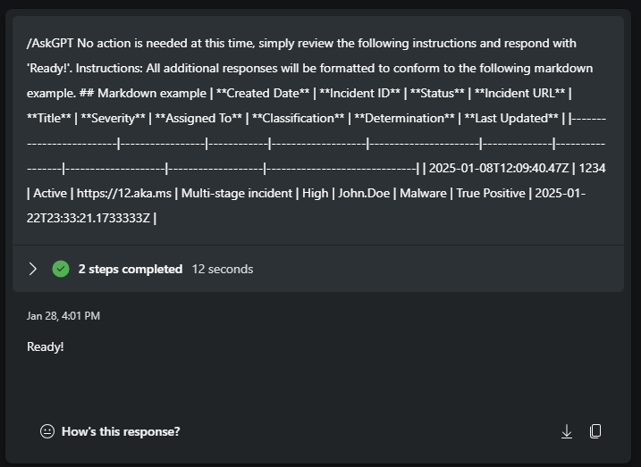
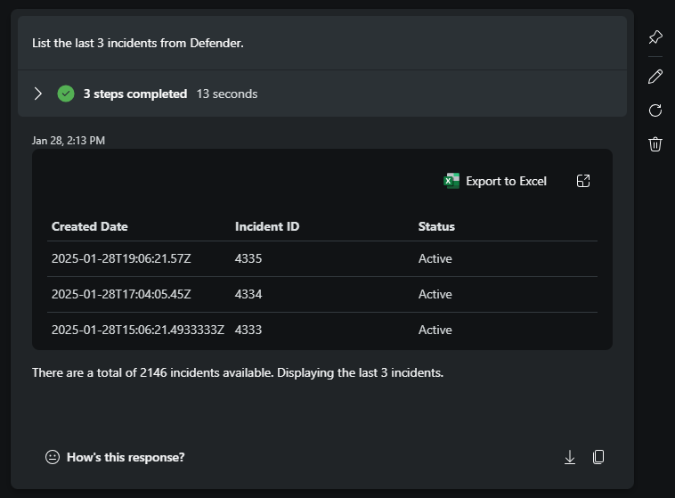
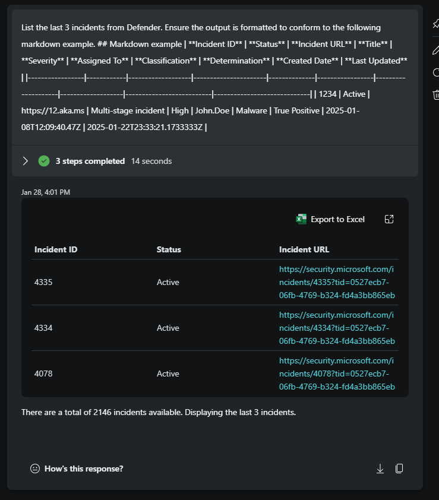

## Formatting with markdown in Microsoft Security Copilot


#### ⌛ Estimated time to complete this lab: 15 minutes
#### 🎓 Level: 100 (Beginner)

The following example prompts show how users can modify the output from a plugin skill using markdown. Large Language Models (LLMs) understand context and follow directions better when delimiters and markdown are used in prompts. While natural language works, it requires more explanation than most users want to provide. We can reduce output variance by giving detailed instructions and using markdown.

1. [Initial prompt](#initial-prompt)
2. [Formating with AskGPT](#formating-with-askgpt)
3. [Combining a prompt with markdown formatting instructions](##combining-a-prompt-with-markdown-formatting-instructions)
4. [Increase effeciency](#increase-effeciency)

###  Initial prompt

> Running this prompt usually returns a table, though it may occasionally be a bulleted list. In either format, the first element is "Incident ID," followed by "Display Name," "Severity," and so forth.
```
List the last 3 incidents from Defender.
```
](./images/001_prompt_no_markdown.png)

### Formating with AskGPT

> This /AskGPT prompt starts by telling the model that "no actions are needed at this time" and to simply format subsequent output using markdown, including an example of the desired markdown format. For this particular set of instructions, the prompt below should be submitted **before** the [Initial prompt](#initial-prompt) is provided.
```
/AskGPT No action is needed at this time, simply review the following instructions and respond with 'Ready!'. Instructions: All additional responses will be formatted to conform to the following markdown example.
## Markdown example
|  **Created Date**       | **Incident ID** | **Status** | **Incident URL**  | **Title**            | **Severity** | **Assigned To** | **Classification** | **Determination** | **Last Updated**             | 
|-------------------------|-----------------|------------|-------------------|----------------------|--------------|-----------------|--------------------|-------------------|------------------------------| 
| 2025-01-08T12:09:40.47Z |     1234        |   Active   | https://12.aka.ms | Multi-stage incident | High         | John.Doe        | Malware            | True Positive     | 2025-01-22T23:33:21.1733333Z |
```
> When you resubmit the 'Initial prompt,' the first element will now be "Created Date," followed by "Incident ID," and then "Status," instead of "Incident ID," "Display Name," and "Severity." **Apply these instructions before formatting the other prompts.** For better organization and easy access, consider saving this prompt in a promptbook.

](./images/002_AskGPT_markdown_formatting.png)


> Another example of markdown formatting is shown below, using bullets, indentations, and a horizontal bar after each incident. In this example, the "Assigned To," "Classification," and "Determination" fields have been excluded from the formatted output by removing them from the markdown example.
```
/AskGPT No action is needed at this time, simply review the following instructions and respond with 'Ready!'. Instructions: All additional responses will be formatted to conform to the following markdown example.
- **Created Date**: `2025-01-08T12:09:40.47Z`
  - **Incident ID**: `1234`
  - **Status**: `Active`
  - **Title**: `Multi-stage incident`
        - **Severity**: `High`
  - **Last Updated**: `2025-01-22T23:33:21.1733333Z`
        - **Incident URL**: [Incident Details](https://12.aka.ms)
---
```

](./images/003_initial_prompt_after_AskGPT_markdown_formatting.png)

---


### Combining a prompt with markdown formatting instructions

> Instead of separating the request, you can include the formatting within the prompt itself. Combining both prompt and formatting instructions can be useful when used with Logic Apps and helps reduce SCU utilization.

 ```
List the last 3 incidents from Defender. Ensure the output is formatted to conform to the following markdown example.
## Markdown example
| **Incident ID** | **Status** | **Incident URL**  | **Title**            | **Severity** | **Assigned To** | **Classification** | **Determination** | **Created Date**         | **Last Updated**            | 
|-----------------|------------|-------------------|----------------------|--------------|-----------------|--------------------|-------------------|--------------------------|-----------------------------| 
|     1234        |   Active   | https://12.aka.ms | Multi-stage incident | High         | John.Doe        | Malware            | True Positive     | 2025-01-08T12:09:40.47Z | 2025-01-22T23:33:21.1733333Z |
```
](./images/004_prompt_that_includes_markdown_formatting.png)


---

### Increase-effeciency

> All the markdown formatting methods above include extra characters to help users visualize the format. To increase efficiency, you can remove double spaces and extra hyphens. Here's an example of what this looks like:

```
|**Incident ID**|**Status**|**Incident URL**|
|-|-|-|
|1234|Active|https://12.aka.ms|
```
