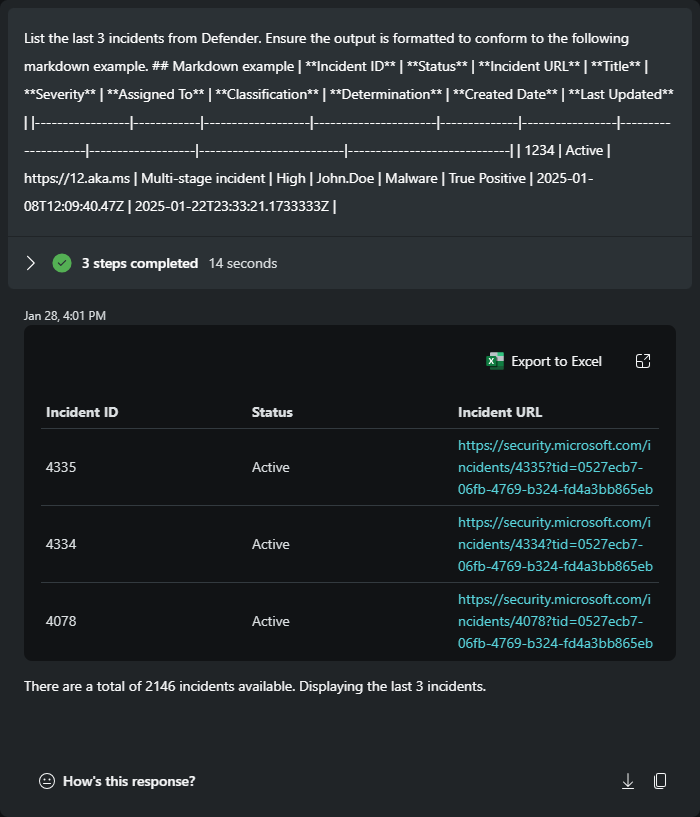

## Formatting with markdown in Microsoft Security Copilot


#### ⌛ Estimated time to complete this lab: 15 minutes
#### 🎓 Level: 100 (Beginner)

The following example prompts demonstrate how users can modify the output from a plugin skill using markdown. Large Language Models (LLMs) interpret context and follow instructions more effectively when delimiters and markdown are included in prompts. Although natural language can be used, it often requires more detailed explanations than most users are willing to provide. By offering clear instructions and utilizing markdown, as covered in this module, you can reduce the likelihood of output variance.

1. [Initial prompt](#initial-prompt)
2. [Formating as a table with AskGPT](#formating-as-a-table-with-askgpt)
3. [Formating as a list with AskGPT](#formating-as-a-list-with-askgpt)
4. [Combining a prompt with markdown formatting instructions](##combining-a-prompt-with-markdown-formatting-instructions)
5. [Increase effeciency](#increase-effeciency)

###  Initial prompt

> Running a prompt without specifying output expectations can lead to inconsistent formatting, such as alternating between tables and bullet points. When users don't provide detailed instructions on the desired output format, the skill will return all available data. In this example, the output starts with "Incident ID," followed by "Display Name," "Severity," and so on.

```
List the last 3 incidents from Defender.
```
[](./images/001_prompt_no_markdown.png)

### Formating as a table with AskGPT

> To modify the default output, we can use the /AskGPT skill and instruct the model to take no action other than reading the instructions. Then, specify that subsequent outputs should follow the provided markdown format. Keep in mind that this will not reformat existing results; the instruction must be set **before** the prompt for which you want to change the output format.
```
/AskGPT No action is needed at this time, simply review the following instructions and respond with 'Ready!'. Instructions: All additional responses will be formatted to conform to the following markdown example.
## Markdown example
|  **Created Date**       | **Incident ID** | **Status** | **Incident URL**  | **Title**            | **Severity** | **Assigned To** | **Classification** | **Determination** | **Last Updated**             | 
|-------------------------|-----------------|------------|-------------------|----------------------|--------------|-----------------|--------------------|-------------------|------------------------------| 
| 2025-01-08T12:09:40.47Z |     1234        |   Active   | https://12.aka.ms | Multi-stage incident | High         | John.Doe        | Malware            | True Positive     | 2025-01-22T23:33:21.1733333Z |
```
[](./images/002_AskGPT_markdown_formatting.png)

> Notice that re-running the [Initial prompt](#initial-prompt) now results with the first column of "Created Date," followed by "Incident ID," and then "Status," instead of "Incident ID," "Display Name," and "Severity." **Be sure to apply these instructions before formatting other prompts.** For better organization and easier access, consider saving this prompt in a promptbook.

[](./images/003_initial_prompt_after_AskGPT_markdown_formatting.png)

### Formating as a list with AskGPT

> Another example of markdown formatting is shown below, using bullets, indentations, and a horizontal bar after each incident. In this example, the "Assigned To," "Classification," and "Determination" fields have been excluded from the formatted output by removing them from the markdown example.
```
/AskGPT No action is needed at this time, simply review the following instructions and respond with 'Ready!'. Instructions: All additional responses will be formatted to conform to the following markdown example.
- **Created Date**: `2025-01-08T12:09:40.47Z`
  - **Incident ID**: `1234`
  - **Status**: `Active`
  - **Title**: `Multi-stage incident`
        - **Severity**: `High`
  - **Last Updated**: `2025-01-22T23:33:21.1733333Z`
        - **Incident URL**: [Incident Details](https://12.aka.ms)
---
```


---


### Combining a prompt with markdown formatting instructions

> Instead of separating the request, you can include the formatting within the prompt itself. Combining both prompt and formatting instructions can be useful when used with Logic Apps and helps reduce SCU utilization.

 ```
List the last 3 incidents from Defender. Ensure the output is formatted to conform to the following markdown example.
## Markdown example
| **Incident ID** | **Status** | **Incident URL**  | **Title**            | **Severity** | **Assigned To** | **Classification** | **Determination** | **Created Date**         | **Last Updated**            | 
|-----------------|------------|-------------------|----------------------|--------------|-----------------|--------------------|-------------------|--------------------------|-----------------------------| 
|     1234        |   Active   | https://12.aka.ms | Multi-stage incident | High         | John.Doe        | Malware            | True Positive     | 2025-01-08T12:09:40.47Z | 2025-01-22T23:33:21.1733333Z |
```
[](./images/004_prompt_that_includes_markdown_formatting.png)


---

### Increase-effeciency

> All the markdown formatting methods above include extra characters to help users visualize the format. To increase efficiency, you can remove double spaces and extra hyphens. Here's an example of what this looks like:

```
|**Incident ID**|**Status**|**Incident URL**|
|-|-|-|
|1234|Active|https://12.aka.ms|
```
